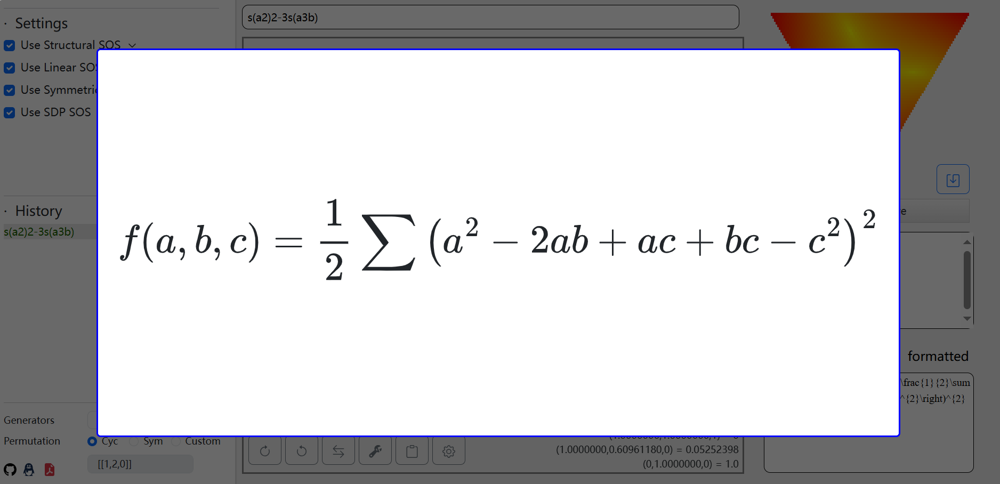

# Triples

Triples 是由 forever豪3 开发的基于 Python 的 SymPy 库的多项式不等式自动证明程序。其专注于通过配方法生成不等式的可读证明。它同时提供直观的图形界面与代码接口，助力代数不等式的探索。

Triples is an automatic inequality proving software developed by ForeverHaibara, based on the Python SymPy library. It focuses on generating readable proofs of inequalities through sum of squares (SOS). The program offers both a graphical user interface and a code interface to facilitate the exploration of Olympiad-level algebraic inequalities.

> 在线体验 Online Servers:

**GitHub Page & Documentation** [https://foreverhaibara.github.io/#/triples](https://foreverhaibara.github.io/#/triples)

> Gradio Servers

* **Hugging Face**      [https://huggingface.co/spaces/ForeverHaibara/Ternary-Inequality-Prover](https://huggingface.co/spaces/ForeverHaibara/Ternary-Inequality-Prover)
* **AIStudio**               [https://aistudio.baidu.com/application/detail/37245](https://aistudio.baidu.com/application/detail/37245)
* **AIStudio Backup** [https://aistudio.baidu.com/application/detail/13542](https://aistudio.baidu.com/application/detail/13542)

<p>范例 Notebook Examples:</p>
<a href="notebooks/examples.ipynb" style="
  display: inline-block;
  padding: 8px 16px;
  background-color: #2563eb; /* Soft blue */
  color: white;
  text-decoration: none;
  border-radius: 4px;
  font-weight: 500;
  font-family: -apple-system, BlinkMacSystemFont, 'Segoe UI', Roboto, sans-serif;
  transition: background-color 0.2s ease;
">
  View Examples Notebook
</a>

<!-- <a href="https://colab.research.google.com/github/ForeverHaibara/Triple-SOS/blob/main/notebooks/examples.ipynb" target="_blank" style="display:inline-block; background-color:#f9ab00; color:white; text-decoration:none; padding:10px 15px; border-radius:5px; font-family:Arial,sans-serif; font-size:14px; font-weight:bold;">
  <i class="fa fa-colab" style="margin-right:5px;"></i> Open in Colab
</a> -->

**注意: 配方器并非采用完备的算法, 没有成功配方不代表问题错误.**

**NOTE: The solver does not use a complete algorithm. It may fail to find a proof for difficult problems.**

<br>

## 代码调用 Code Usage

See more in the Jupyter notebook:    [notebooks/examples.ipynb](notebooks/examples.ipynb)

Ensure "triples" is in the directory or the system path.

```
pip install sympy
pip install numpy
pip install scipy
pip install clarabel
```

```py
from triples.core import sum_of_squares
import sympy as sp
a, b, c, x, y, z = sp.symbols("a b c x y z")
```

### Sum of Squares

Given a sympy polynomial, the `sum_of_squares` solver  will return a Solution-class object if it succeeds. It returns None if it fails (but it does not mean the polynomial is not a sum of squares or positive semidefinite).

**Example 1** $a,b,c\in\mathbb{R}$, prove:  $\left(a^2+b^2+c^2\right)^2\geq 3\left(a^3b+b^3c+c^3a\right)$.

```py
>>> sol = sum_of_squares((a**2 + b**2 + c**2)**2 - 3*(a**3*b + b**3*c + c**3*a))
>>> sol.solution # this should be a sympy expression
(Σ(a**2 - a*b - a*c - b**2 + 2*b*c)**2)/2
>>> sol.solution.doit() # this expands the cyclic sums
(-a**2 + 2*a*b - a*c - b*c + c**2)**2/2 + (a**2 - a*b - a*c - b**2 + 2*b*c)**2/2 + (-a*b + 2*a*c + b**2 - b*c - c**2)**2/2
```

<br>

If there are inequality or equality constraints, send them as a list of sympy expressions to `ineq_constraints` and `eq_constraints`.

**Example 2** $a,b,c\in\mathbb{R}_+$, prove:  $a(a-b)(a-c)+b(b-c)(b-a)+c(c-a)(c-b)\geq 0$.

```py
>>> sol = sum_of_squares(a*(a-b)*(a-c) + b*(b-c)*(b-a) + c*(c-a)*(c-b), ineq_constraints = [a,b,c])
>>> sol.solution
((Σ(a - b)**2*(a + b - c)**2)/2 + Σa*b*(a - b)**2)/(Σa)
```

<br>

If you want to track the inequality and equality constraints, you can send in a dict containing the alias of the constraints.

**Example 3** $a,b,c\in\mathbb{R}_+$ and $abc=1$, prove: $\sum \frac{a^2}{2+a}\geq 1$.

```py
>>> sol = sum_of_squares(((a+2)*(b+2)*(c+2)*(a**2/(2+a)+b**2/(2+b)+c**2/(2+c)-1)).cancel(), ineq_constraints=[a,b,c], eq_constraints={a*b*c-1:x})
>>> sol.solution
x*(Σ(2*a + 13))/6 + Σa*(b - c)**2 + (Σa*b*(c - 1)**2)/6 + 5*(Σ(a - 1)**2)/6 + 7*(Σ(a - b)**2)/12
>>> sol.solution.doit()
a*b*(c - 1)**2/3 + a*c*(b - 1)**2/3 + a*(-b + c)**2 + a*(b - c)**2 + b*c*(a - 1)**2/3 + b*(-a + c)**2 + b*(a - c)**2 + c*(-a + b)**2 + c*(a - b)**2 + x*(4*a + 4*b + 4*c + 78)/6 + 7*(-a + b)**2/12 + 7*(-a + c)**2/12 + 5*(a - 1)**2/3 + 7*(a - b)**2/12 + 7*(a - c)**2/12 + 7*(-b + c)**2/12 + 5*(b - 1)**2/3 + 7*(b - c)**2/12 + 5*(c - 1)**2/3

>>> F = sp.Function("F")
>>> sol = sum_of_squares(((a+2)*(b+2)*(c+2)*(a**2/(2+a)+b**2/(2+b)+c**2/(2+c)-1)).cancel(), {a: F(a), b: F(b), c: F(c)}, {a*b*c-1:x})
>>> sol.solution
x*(Σ(2*F(a) + 13))/6 + Σ(a - b)**2*F(c) + (Σ(a - 1)**2*F(b)*F(c))/6 + 5*(Σ(a - 1)**2)/6 + 7*(Σ(a - b)**2)/12
```

## 图形化界面 Graphic User Interface

本程序图形化界面有两种启动方式: Flask 与 Gradio.

Two graphical backends are supported: Flask and Gradio.

### Flask 启动

1. 安装依赖: Install Dependencies

```
pip install sympy
pip install numpy
pip install scipy
pip install clarabel
pip install flask
pip install flask_cors
pip install flask_socketio
```

2. 控制台中运行 `python web_main.py` 启动后端. Run `python web_main.py` to launch the backend.
3. 浏览器打开 `triples.html` 即可使用. Open `triples.html` in your browser.

### Gradio 启动

1. 安装依赖: Install Dependencies

```
pip install sympy
pip install numpy
pip install scipy
pip install clarabel
pip install gradio>=5.0
pip install pillow
```

1. 控制台中运行 `python gradio.app.py` 启动后端. Run `python gradio.app.py` to launch the backend.
2. 浏览器打开控制台中显示的地址. Open the link displayed in the console using the browser.

输入关于 a,b,c 的齐次式. 注: 幂符号 ^ 可以省略, 函数 s 与 p 分别表示轮换和与轮换积，例如 `s(a2)` 表示 `a^2+b^2+c^2`. 非齐次或更多元多项式也能配方,
但没有可视化功能.

Input a homogeneous polynomial with respect to variables a,b,c. The exponential symbol ^ can be omitted. Functions s(...) and p(...) stand for cyclic sum and cyclic product, respectively. For instance, inputting `s(a2)` means `a^2+b^2+c^2`. Non-homogeneous polynomials or more variables are also supported, but they will not be visualized.



修改左下角的 Generators 可以可视化四元齐次多项式.

Configure the Generators in the bottom left corner to visualize quaternary homogeneous polynomials.


## 讨论交流 Discussions

* 配方器交流群 1001789778 .
* Issues are welcome.

## 算法 Algorithms
The algorithm uses a graph-based search to discover a sum-of-squares proof for a given inequality.  
Each inequality is encapsulated in a ProofNode that may spawn child nodes representing sub-goals.  
For every polynomial (semialgebraic) inequality the system can either

1. apply symbolic transformations such as substitution, pivoting, or homogenization, or  
2. invoke one of the back-end solvers:

   - **StructuralSOS** – exploits known algebraic structures for fast, readable proofs  
   - **LinearSOS** – relaxes the problem to linear programming (LP); supports a degree hierarchy  
   - **SDPSOS** – relaxes the problem to semidefinite programming (SDP)

Whenever an LP or SDP solver returns a numerical solution, the result is rationalized to yield an exact, certificate-grade proof.
 


<table style="width: 100%; border-collapse: collapse; font-family: -apple-system, BlinkMacSystemFont, 'Segoe UI', Roboto, sans-serif; font-size: 14px; line-height: 1.5;">
  <thead>
    <tr style="background-color: #f0f4f8;">
      <th style="padding: 12px; text-align: left; border: 1px solid #dee2e6; font-weight: 600; color: #2d3748;">Metric</th>
      <th style="padding: 12px; text-align: left; border: 1px solid #dee2e6; font-weight: 600; color: #2d3748;">StructuralSOS</th>
      <th style="padding: 12px; text-align: left; border: 1px solid #dee2e6; font-weight: 600; color: #2d3748;">LinearSOS</th>
      <th style="padding: 12px; text-align: left; border: 1px solid #dee2e6; font-weight: 600; color: #2d3748;">SDPSOS</th>
    </tr>
  </thead>
  <tbody>
    <tr style="background-color: #ffffff;">
      <td style="padding: 12px; border: 1px solid #dee2e6; color: #4a5568; font-weight: 500;">Relaxation/Cone</td>
      <td style="padding: 12px; border: 1px solid #dee2e6; color: #4a5568;">Specific</td>
      <td style="padding: 12px; border: 1px solid #dee2e6; color: #4a5568;">LP (+degree hierachy)</td>
      <td style="padding: 12px; border: 1px solid #dee2e6; color: #4a5568;">SDP</td>
    </tr>
    <tr style="background-color: #f8f9fa;">
      <td style="padding: 12px; border: 1px solid #dee2e6; color: #4a5568; font-weight: 500;">Speed</td>
      <td style="padding: 12px; border: 1px solid #dee2e6; color: #4a5568;">Fast</td>
      <td style="padding: 12px; border: 1px solid #dee2e6; color: #4a5568;">Slow for large number of variables</td>
      <td style="padding: 12px; border: 1px solid #dee2e6; color: #4a5568;">Slow for high-degree problems</td>
    </tr>
    <tr style="background-color: #ffffff;">
      <td style="padding: 12px; border: 1px solid #dee2e6; color: #4a5568; font-weight: 500;">Solution</td>
      <td style="padding: 12px; border: 1px solid #dee2e6; color: #4a5568;">Pretty</td>
      <td style="padding: 12px; border: 1px solid #dee2e6; color: #4a5568;">Moderate</td>
      <td style="padding: 12px; border: 1px solid #dee2e6; color: #4a5568;">Very lengthy</td>
    </tr>
  </tbody>
</table>

<br>

<p align="center">

</p>
